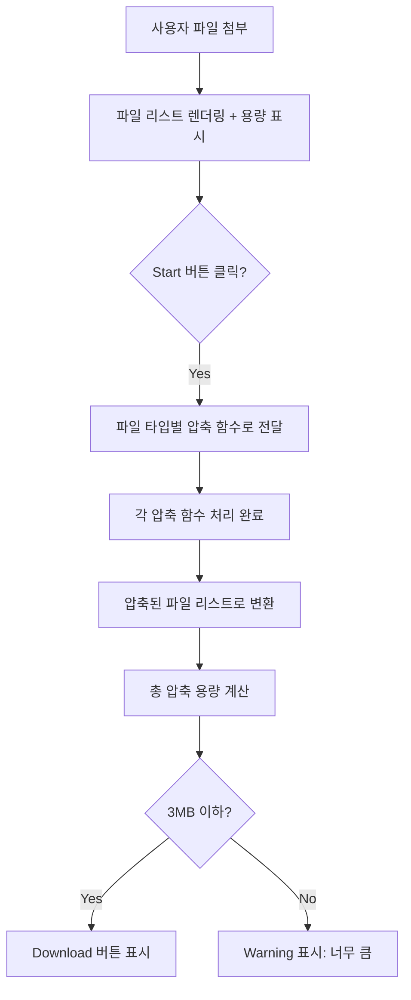

## 시스템 이용 예시 시나리오 (사용자 흐름)

| 단계  | 설명                                                                  |
| --- | ------------------------------------------------------------------- |
| 1️⃣ | 사용자가 확장 프로그램 실행 후 여러 개 파일 첨부 (`pptx`, `docx`, `xlsx`, `pdf`, 이미지 등) |
| 2️⃣ | UI에서 전체 첨부 용량 표시 (예: `10MB / 3MB`)                                  |
| 3️⃣ | 사용자 `Start Process` 클릭 시 각 파일에 맞는 압축기 작동                            |
| 4️⃣ | 모든 파일 압축 후, **최종 압축 용량 계산**                                         |
| 5️⃣ | 조건 충족 시 `Download` 버튼 활성화                                           |
| 6️⃣ | 압축된 파일들을 다운로드 (ZIP 또는 개별 파일)                                        |

---

## 시스템 동작 로직 (JavaScript 중심)



---

## 파일 구성 및 역할

| 파일/폴더                | 설명                           |
| -------------------- | ---------------------------- |
| `popup.js`           | 메인 UI 로직, 이벤트 처리, 프로세스 전체 실행 |
| `compress/`          | 파일 종류별 압축 함수 (docx, pdf 등)   |
| `utils/fileUtils.js` | 공통 함수 (파일 사이즈 계산, 확장자 추출 등)  |
| `styles/popup.css`   | 팝업 UI 스타일                    |
| `popup.html`         | UI 뼈대 구성                     |
| `manifest.json`      | 크롬 확장 정보 정의                  |

---

## compress/ 모듈 설계 제안

각 모듈은 동일한 인터페이스로 만들어야 `popup.js`에서 일관되게 호출 가능:

### compress/docs.js

```js
import JSZip from 'jszip';
import { compressImage } from './img.js';

export async function compressDocs(file) {
	const zip = await JSZip.loadAsync(file);
	const media = zip.folder('word/media');
	if (!media) return null;

	const files = [];
	media.forEach((relPath, fileObj) => {
		files.push({ path: relPath, file: fileObj });
	});

	for (const f of files) {
		const blob = await zip.file(`word/media/${f.path}`).async('blob');
		const compressed = await compressImage(blob);
		zip.file(`word/media/${f.path}`, compressed);
	}

	const newBlob = await zip.generateAsync({ type: 'blob' });
	return new File([newBlob], file.name, { type: file.type });
}
```

> `pptx`와 `xlsx`도 `ppt/media/`, `xl/media/`만 다르고 구조 동일


## 📐 utils/fileUtils.js 예시

```js
export function formatSize(bytes) {
	const kb = 1024;
	const mb = kb * 1024;
	if (bytes > mb) return (bytes / mb).toFixed(2) + ' MB';
	if (bytes > kb) return (bytes / kb).toFixed(1) + ' KB';
	return bytes + ' B';
}

export function getTotalSize(files) {
	return files.reduce((acc, file) => acc + file.size, 0);
}
```

---

## 성능 및 메모리 관리 팁

* `URL.createObjectURL` 사용 후, 사용 끝나면 반드시 `URL.revokeObjectURL`
* 압축 실패 시에도 임시 객체 클린업 필요
* `OffscreenCanvas` or `Worker` 사용 고려 (메인 UI block 방지)

---

## 최적화 디렉토리 구조

```
Compressor/
├── manifest.json                 # Chrome Extension 설정 (MV3)
├── popup.html                    # 팝업 UI
├── popup.js                      # 메인 로직 컨트롤러
│
├── compress/                    # 파일 종류별 압축 로직
│   ├── index.js                 # 압축 엔트리 포인트 (타입에 따라 분기)
│   ├── docs.js                  # DOCX, PPTX 압축 (JSZip)
│   ├── excel.js                 # XLSX 압축
│   ├── pdf.js                   # PDF 압축 (pdf-lib)
│   └── img.js                   # 이미지 압축 (canvas)
│
├── core/                        # 압축 외 핵심 로직 (비즈니스 로직/로딩/파일 관리 등)
│   ├── controller.js            # 프로세스 흐름 제어 (startProcess 같은 기능)
│   ├── fileManager.js           # 파일 파싱, 변환, 메타데이터 저장
│   └── sizeManager.js           # 용량 계산, 3MB 체크 로직
│
├── utils/                       # 유틸리티 함수 모음
│   ├── fileUtils.js             # 포맷 변환, 파일 사이즈 계산 등
│   └── logger.js                # 로그 출력을 위한 헬퍼
│
├── styles/                      # CSS 스타일 파일
│   └── popup.css
│
├── assets/                      # 아이콘, 이미지
│   ├── icon-16.png
│   ├── icon-48.png
│   └── icon-128.png
│
└── README.md                    # 프로젝트 설명
```

---

## 📌 역할 설명 요약

| 디렉토리 / 파일       | 설명                           |
| --------------- | ---------------------------- |
| `manifest.json` | 확장 기능의 설정 (권한, 팝업 경로 등)      |
| `popup.html`    | 확장 팝업의 HTML                  |
| `popup.js`      | 버튼 이벤트, 렌더링, 압축 시작 등 UI 중심   |
| `compress/`     | 확장자 기반 압축 모듈                 |
| `core/`         | 상태 관리와 전체 프로세스 흐름 분리         |
| `utils/`        | 공통 유틸 함수들 (사이즈 계산, 파일 네이밍 등) |
| `styles/`       | 스타일 시트                       |
| `assets/`       | 아이콘, 배너, UI 리소스              |

---


